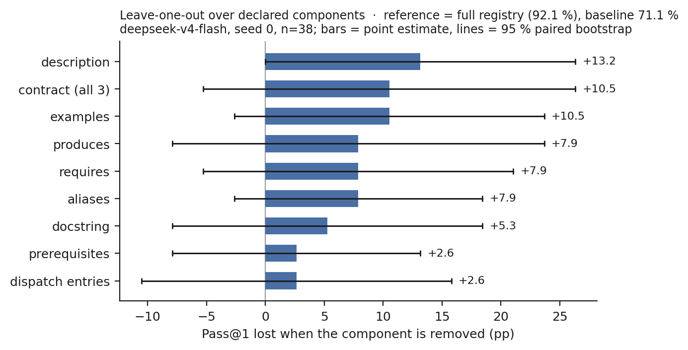
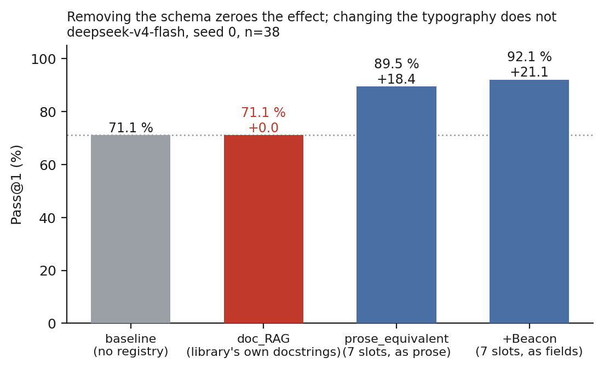
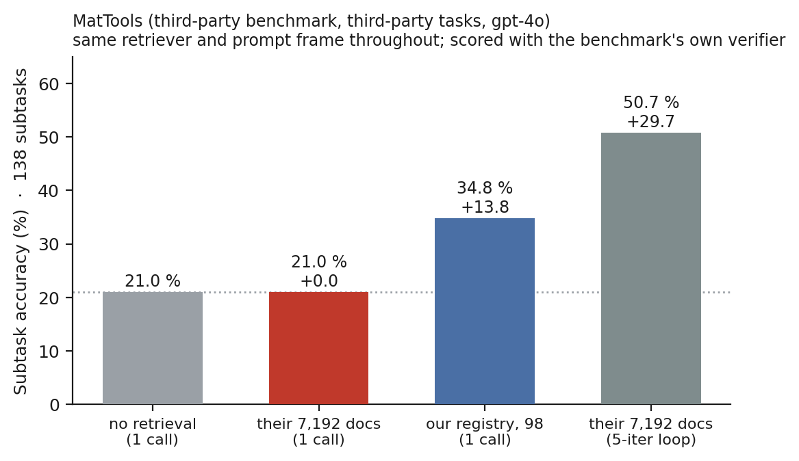
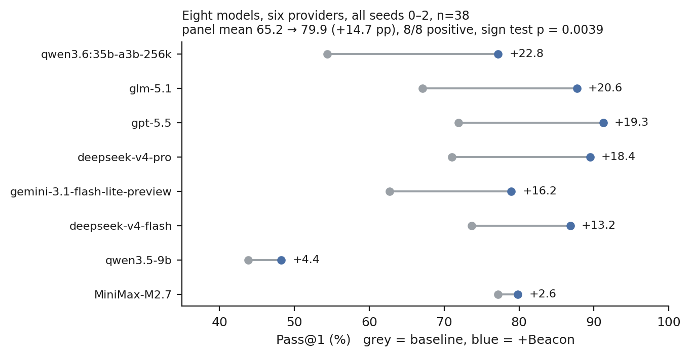

# Beacon — rebuttal materials

Supporting code, data and figures for the author response. Everything here was
produced during the discussion period. Each section names the reviewer point it
answers, the number reported in the response, and the file the number comes
from, so any figure can be recomputed rather than taken on trust.

All figures are regenerated by `code/make_rebuttal_figures.py`, which reads the
per-trajectory `grades.csv` files in `results/` — no number in a figure is typed
in by hand.

```
figures/     four PNGs, referenced from the responses
results/     per-trajectory grades, MatTools scoring records, probe output
code/        the scripts that produced them
```

---

## 1. Per-component contribution

**Answers:** "Which Beacon components contribute most to the improvement? A
per-component ablation over aliases, examples, requires/produces metadata,
related functions, dispatch virtual entries, and skills would clarify this."



Leave-one-out over the nine declared components. Each arm removes one component
**from the retrieval signal as well as from the rendered output** — ablating
only the rendered text would leave `aliases` still driving `alias_score`, so the
entry would keep its rank while hiding the reason. `code/ablate_lookup.py`
patches `RegistryScanner.rank_entry` to strip the field before ranking.

| Component removed | Pass@1 | Loss vs. full registry | Share of uplift | 95 % CI |
|---|---:|---:|---:|---|
| description | 78.9 % | **+13.2** | 63 % | [+0.0, +26.3] |
| contract (requires+produces+prerequisites) | 81.6 % | +10.5 | 50 % | [−5.3, +26.3] |
| examples | 81.6 % | +10.5 | 50 % | [−2.6, +23.7] |
| produces | 84.2 % | +7.9 | 37 % | [−7.9, +23.7] |
| requires | 84.2 % | +7.9 | 37 % | [−5.3, +21.1] |
| aliases | 84.2 % | +7.9 | 37 % | [−2.6, +18.4] |
| docstring | 86.8 % | +5.3 | 25 % | [−7.9, +18.4] |
| prerequisites | 89.5 % | +2.6 | 13 % | [−7.9, +13.2] |
| dispatch entries | 89.5 % | +2.6 | 13 % | [−10.5, +15.8] |

Reference: full registry 92.1 %, baseline 71.1 %, uplift +21.1 pp.
`deepseek-v4-flash`, seed 0, n = 38.

Two things we report rather than bury. Seed 0 is the highest of the full
registry's three seeds (92.0 / 84.0 / 88.0), so these losses are **upper
bounds**. And **eight of nine confidence intervals contain zero** — at 38 tasks
and one seed the ordering is directional, not resolved.

**Skills** could not be ablated on the same footing. `skill_lookup` returns
Markdown recipes that restate prerequisites and container keys in prose, so
removing those fields from `registry_lookup` while the skill channel still
answers them would drive the contract arms to zero by construction. Measured
traffic: 1,000 `skill_lookup` calls across 1,199 trajectories, 39 % of which use
both channels. The four contract arms therefore ran with the skill channel
disabled.

**`related` turns out never to reach the agent.** The decorator requires it and
the Agent-Friendliness Score scores it, but the lookup handler does not render
it. We found this while building the ablation and are disclosing it.

Data: `results/ablation/abl_*.csv`, `results/ablation/deepseek_v4flash_canonical.csv`
Code: `code/ablate_lookup.py`

---

## 2. What the doc-RAG baseline was, and what it isolates

**Answers:** "How strong was the doc-RAG baseline? Please clarify the retriever,
index granularity, indexed fields, and whether stronger BM25 or hybrid
sparse/dense retrieval baselines were tested."



**Configuration as run.** Retriever `all-MiniLM-L6-v2` sentence embeddings,
top-8. Index granularity: one document per public callable. Indexed fields: raw
signature plus `inspect.getdoc` output. The retrieved block is injected into the
identical prompt frame as the registry, so the two arms differ only in what the
block contains. **No BM25 or hybrid sparse/dense variant was tested**, and we do
not claim one.

Building the third bar taught us that the word *structure* was covering two
separate claims in our paper:

* the **schema** — which slots exist, i.e. what the decorator obliges an author
  to write down;
* the **typography** — whether those slots print as labelled fields or as
  flowing sentences.

`doc_RAG` is the schema ablation: the agent gets the library's real
documentation, on the same retrieval channel, and it declares none of the seven
slots. `prose_equivalent` is **not** a second schema ablation — the renderer
(`code/prose_render.py`) keeps every one of the seven slots intact and distinct
and changes only the punctuation.

| Arm | Pass@1 | Δ | Schema | Typography |
|---|---:|---:|---|---|
| baseline | 71.1 % | — | none | — |
| `doc_RAG` | 71.1 % | **+0.0** | **none** | library's own |
| `prose_equivalent` | 89.5 % | +18.4 | all seven slots | prose |
| `+Beacon` | 92.1 % | +21.1 | all seven slots | labelled fields |

Typography residual +2.2 pp, 95 % bootstrap CI [−4.8, +9.2], McNemar 7 v 4,
p = 0.549.

`code/verify_prose_parity.py` checks that the prose renderer is information-
preserving: identical rank order on 15 queries, 890/890 facts carried, token
count within 0.8 % under `o200k_base`.

Data: `results/ablation/ablation_v4flash_doc_rag.csv`,
`results/ablation/ablation_v4flash_prose.csv`
Code: `code/prose_render.py`, `code/verify_prose_parity.py`

---

## 3. Cross-library validation on a different state model

**Answers:** "Can the authors provide stronger cross-library validation beyond
the small scikit-learn demonstration, especially for libraries with different
state models?"



MatTools (arXiv:2505.10852) is a third-party benchmark over
`pymatgen-analysis-defects`: 49 questions / 138 subtasks, each with its own
verifier, written by other authors. It supplies a second library, a different
state model, and tasks we did not write.

**The contract slots did not transfer, and we report that as a boundary.** A
probe found zero observable state changes across eight `pymatgen` operations and
three probe strategies — its operations add and remove no named state, so
`requires`/`produces` have nothing to bind to. What transferred is the rest of
the schema plus an object-centric substitute for `produces`: `key_results`,
naming the two to five attributes a caller actually reads. That choice was
driven by measurement — 59 % of baseline failures here are the model picking the
right class and then inventing a property name.

Decoration is per-callable, one model call each, reading only source, signature
and docstring (`code/mattools_decorate.py`). The decorating model is
`deepseek-v4-flash`; the benchmark runs `gpt-4o`, which keeps "the registry
helps" separable from "a model wrote itself a cheat sheet". The decorator never
saw the library's test suite — the 49 tasks share names with 56 functions in it
— and never saw a task prompt.

Task accuracy — a question counts only when every property it asks for is
correct, the stricter of the benchmark's two rates. All three arms use one model
call, so the contrast is at matched inference budget:

| Arm | Corpus | Inference | Task acc. | Δ |
|---|--:|---|--:|--:|
| no retrieval | — | 1 call | 18.4 % (9/49) | — |
| their LLM-written docs | 7,192 | 1 call | 24.5 % (12/49) | +6.1 |
| **our registry** | **98** | **1 call** | **32.7 % (16/49)** | **+14.3** |

Registry vs. baseline: paired bootstrap CI [+2.0, +26.5], 9 v 2 questions, sign
test p = 0.065. Registry vs. their corpus: +8.2, CI [−6.1, +22.4], 8 v 4,
p = 0.388 — reported as a point estimate and not as separation, since at 49
questions that interval spans zero. What *is* separated is the entry count: 98
curated entries against 7,192 generated documents over the same library.

On the benchmark's other rate (subtask accuracy over 138 subtasks) the same three
arms read 21.0 / 21.0 / 34.8 %. The registry's advantage holds on both; the
corpus arm's does not. Both rates come from `code/mattools_rescore.py` and
neither was selected after the fact — the figure and the headline use task
accuracy throughout, and the subtask numbers are stated here so the choice is
visible.

**A coincidence worth naming.** Our no-retrieval arm's 18.4 % **task** accuracy
is numerically almost identical to MatTools' published 18.36 % **subtask**
accuracy for the same model. Different metrics that happen to coincide — our
baseline is not a reproduction of theirs, and our prompt runs at temperature 0
where theirs runs at 0.7.

Their own five-iteration agent loop reaches 50.7 % subtask accuracy on their
corpus. It is not plotted and not used as a comparator: it changes the inference
procedure as well as the context, so it answers a different question from the one
about cross-library transfer. It is reported below as a reproduction check.

### Reproducing their harness

Two things had to be matched before any of this was comparable.

**Their dependency pins.** Upstream builds on numpy 1.26.4 / pymatgen 2024.8.9.
NumPy 2 changed scalar repr — `np.True_` where 1.x printed `True` — which their
result parser cannot read, turning correct answers into parse failures.

**Their verification semantics.** Their generated function and their verifier run
in *different containers*, so the returned dict crosses as `print` output and is
parsed back. That round trip launders numpy scalars into the types the verifiers
demand: they test `isinstance(v, eval(declared_format))`, and
`isinstance(np.True_, bool)` is `False` while the printed-and-reparsed value is a
plain `bool`. Handing the verifier live objects is strictly stricter and scores
~11 pp lower on identical code.

With both matched, re-scoring **their own published generations** reproduces
their published numbers:

| their arm | our re-score | their `accuracy_summary.xlsx` |
|---|--:|--:|
| pure agent (3 rounds) | 17.9 % | 18.4 % |
| code RAG (round 1) | 34.8 % | 34.1 % |
| LLM-doc RAG (3 rounds) | 52.7 % | 55.3 % |

We also rebuilt their iterative loop (`code/mattools_loop.py`); run on their
corpus it reaches 50.7 %, matching their published round-1 figure of 50.7 %.

**Disclosures.** We did not run our registry inside that loop, so we make no
matched-budget claim against their best arm; every registry number above is
single-call. Our retriever is `all-MiniLM-L6-v2` where theirs is
`text-embedding-3-large`. Single run on our side against their three rounds.
Execution is an isolated virtual environment rather than Docker; the pins,
verifier and comparison logic are theirs.

Data: `results/mattools/rescore_*.jsonl`, `results/mattools/mattools_final_table.txt`
Code: `code/mattools_*.py`

---

## 4. Panel breadth

**Answers:** the concern that the main evidence is concentrated in one ecosystem,
and the multi-seed caveat.



Completing multi-seed coverage and adding an eighth model moves the headline
**+17.8 → +14.7 pp** while strengthening the distribution-free evidence: **8/8
positive, sign test p ≈ 0.004** (submitted: 7/7 at 0.008). The largest single
change is `qwen3.6-35b-a3b`, whose Δ drops from +34.2 to +22.8 once seeds 1–2 run
on the hosted full-precision model instead of a local Q4\_K\_M build — the
baseline arm gets stronger while the treatment arm is unchanged.

`qwen3.5-9b` is a within-family scale contrast and a useful boundary condition:
weakest baseline in the panel (43.9 %), second smallest uplift (+4.4). Roughly
30 % of its trajectories exhaust the turn budget in *both* arms, and a lookup
that costs turns cannot pay off for a model that cannot finish unaided. Uplift is
not monotone in model weakness.

Data: `results/multi_model_summary.json`

---

## 5. Registry drift, and what the Agent-Friendliness Score misses

**Answers:** the limitation about "version drift between library APIs and
registry entries".

We measured it on our own registry. Every `requires` / `produces` claim in the
445 hand-written entries was tested by execution — `produces` by observation,
`requires` by *removal*, since a function may read a key incidentally.

| | confirmed | refuted | inconclusive |
|---|---:|---:|---:|
| `produces` (132 claims) | 58 | **43** | 31 |
| `requires` (37 claims) | 16 | **8** | 13 |

Separately, **25.4 % of declared contract keys are prose placeholders** rather
than keys (`"cell type labels"`, `"{cluster_col}"`), and the registry
under-declares 1.33 keys for every one it declares correctly.

This exposes a weakness in AFS that we now report: **AFS counts whether a field
is present, not whether it is true**, so placeholders earn contract credit. We
propose adding a *contract-verified rate* — the fraction of emitted contract
pairs a probe confirms.

---

## 6. Maintainer burden

**Answers:** the limitation about "the maintainer burden of writing and
maintaining registry metadata".

Bounded from one side. A registry synthesised from tutorials, documentation,
docstrings and source — 330 entries, every contract claim admitted only after a
probe failed to refute it — recovers **55 %** of the hand-written registry's
uplift.

| Registry | Pass@1 | vs. baseline |
|---|---:|---:|
| none | 73.2 % | — |
| auto-generated (330 entries) | 80.7 % | +7.5 |
| hand-written (445 entries) | 86.8 % | +13.6 |

101 paired cells, 38 tasks, seeds 0–2. The `hand − auto` gap is not resolved at
this sample size (CI [−1.3, +14.0], McNemar 13 v 6, p = 0.167).

The per-layer shape matters more than the mean: synthesis helps most where the
baseline is weakest (+25 to +28 pp on the hardest layers) and mildly hurts where
the baseline is already strong. Actual annotation person-hours are **not**
measured, and we list that as open.

---

## 7. Prior exposure of the evaluated models

**Answers:** the question of whether the evaluated models had already seen the
library.

3 models × 6 libraries × 40 items = 720 closed-book calls, no tools and no
context. Each trial names one function and asks whether it exists in a given
library. Half the names are real, sampled by introspecting the installed
package's public API; half are plausible fakes built by perturbing *different*
real names.

Recall alone is uninterpretable — one model answers "no" to everything (recall 0,
hallucination 0), another answers "yes" to everything (recall 100, hallucination
100). **Discrimination = recall − hallucination** is 0 for both, which is the
truth.

| Model | numpy | pandas | sklearn | scipy | scanpy | **omicverse** |
|---|---:|---:|---:|---:|---:|---:|
| `deepseek-v4-flash` | 100 | 70 | 93 | 40 | 100 | **0** |
| `qwen3.6-35b-a3b` | 17 | −5 | 10 | −4 | 18 | **0** |
| `qwen3.5-9b` | 0 | 0 | 0 | 0 | 0 | **0** |

No evaluated model has discriminable prior knowledge of the target library.
`deepseek-v4-flash` also traces the dose–response the long-tail thesis predicts.

Data: `results/contamination/contamination.json`
Code: `code/contamination_probe.py`

---

## Reproducing

```bash
python code/make_rebuttal_figures.py     # regenerates all four figures
python code/mattools_table.py            # regenerates the MatTools table
python code/verify_prose_parity.py       # checks the prose renderer is lossless
```

Absolute paths in the scripts have been replaced by placeholders (`<REPO>`,
`<MATTOOLS>`, `<ENV>`) for anonymity; set them to point at a checkout to run.
